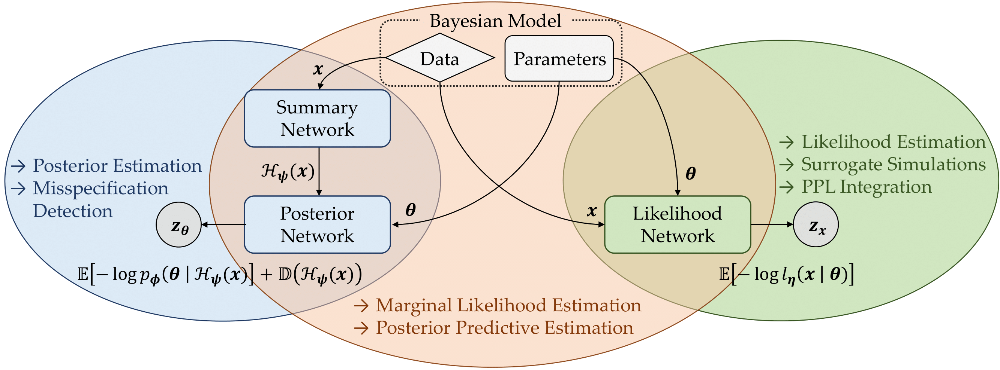

# JANA



This repository contains the code for running and reproducing the experiments from the paper [JANA: Jointly Amortized Neural Approximation of Complex Bayesian Models](https://arxiv.org/abs/2302.09125), presented at the Conference on Uncertainty in Artificial Intelligence (UAI 2023).

JANA lets you train and validate specialized neural networks for <em>simultaneously amortized</em> simulation-based inference and surrogate modeling in a Bayesian framework. The method is described in our paper:

Radev, S. T., Schmitt, M., Pratz, V., Picchini, U., Köthe, U., & Bürkner, P. C. (2023). 
JANA: Jointly Amortized Neural Approximation of Complex Bayesian Models. 
<em>arXiv preprint arXiv:2302.09125</em>, available for free at: https://arxiv.org/abs/2302.09125.

The code depends on the [BayesFlow](https://github.com/stefanradev93/BayesFlow) library, which implements all JANA components and benchmark simulators. Each experiment features self-contained code and individual instructions. Checkpoints for most networks are provided at the cost of the repository's size.

## Cite

Coming soon...

```bibtex
Coming soon...
```

## Support

This work was supported by the Deutsche Forschungsgemeinschaft (DFG, German Research Foundation) under Germany’s Excellence Strategy -– EXC-2181 - 390900948 (the Heidelberg Cluster of Excellence STRUCTURES) and -- EXC-2075 - 390740016 (the Stuttgart Cluster of Excellence SimTech), the Cyber Valley Research Fund (grant number: CyVy-RF-2021-16), the Swedish National Research Council (Vetenskapsrådet 2019-03924), the Chalmers AI Research Centre, the Informatics for Life initiative funded by the Klaus Tschira Foundation and Google Cloud through the Academic Research Grants program.

## License

MIT


